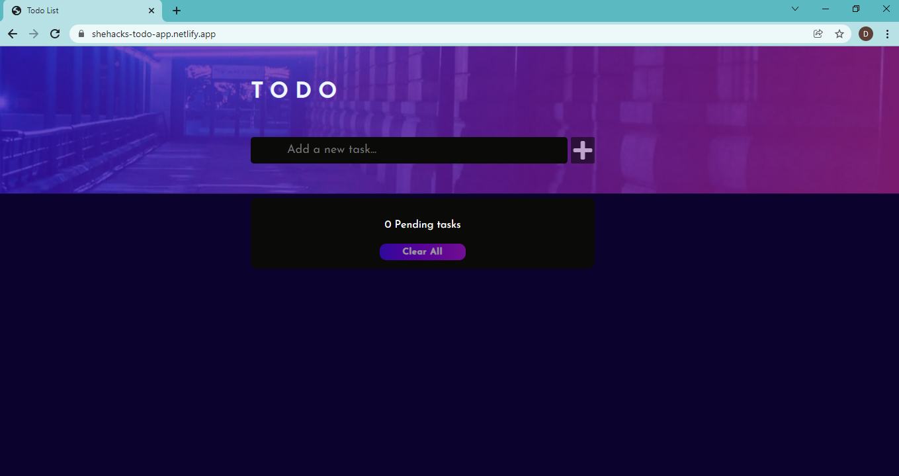
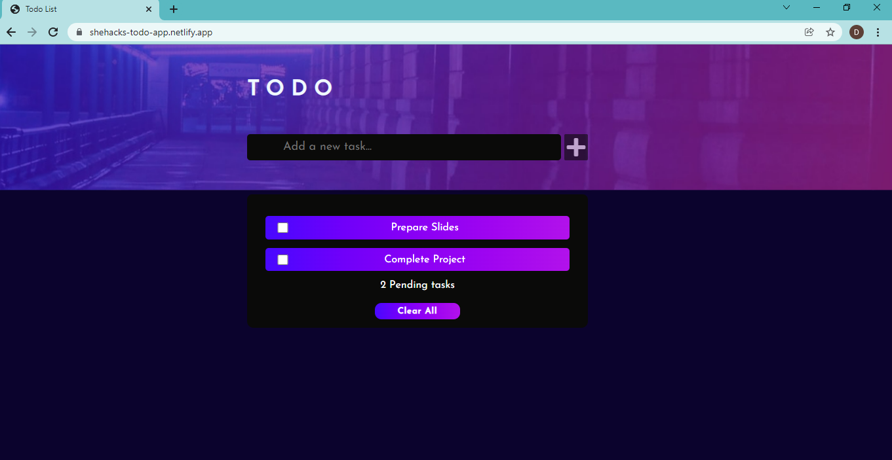
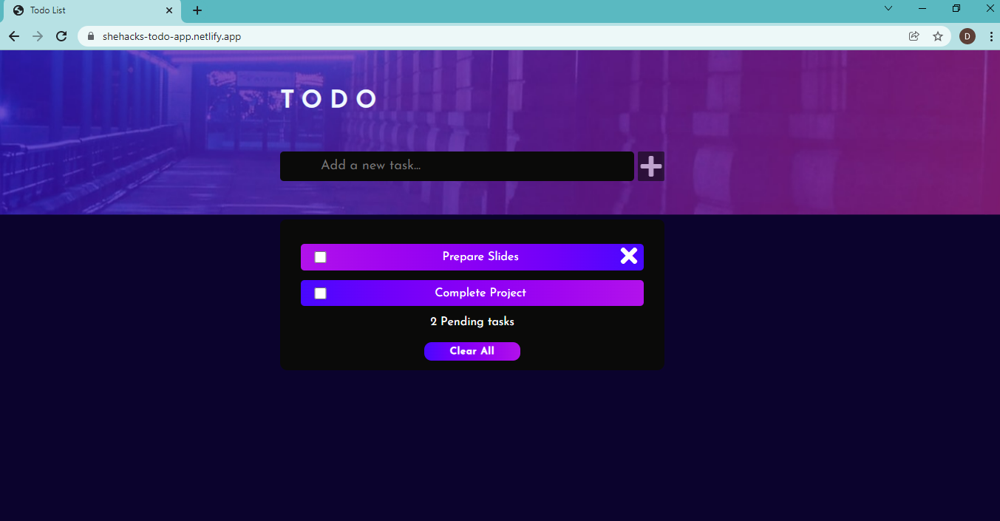
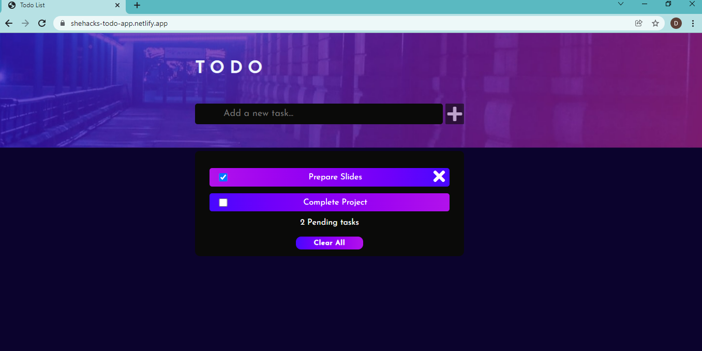

# ToDo-List

# A simple Todo App to schedule your tasks.
## Check it out!
https://shehacks-todo-app.netlify.app/
<!-- ## Link to product walkthrough 
> [Link](https://www.loom.com/share/c38954fcd6484c108301d5b8f1fa58c5) -->
## Features
* Responsive design
* User can add items
* User can delete items
* User can mark items that are done
* Data will be present even after refreshing page
* Interactive
## Screenshots

